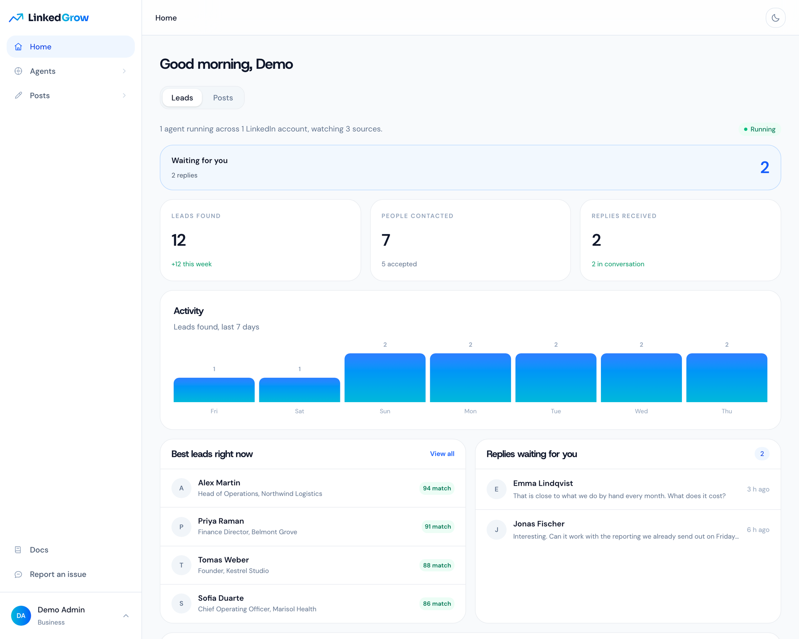
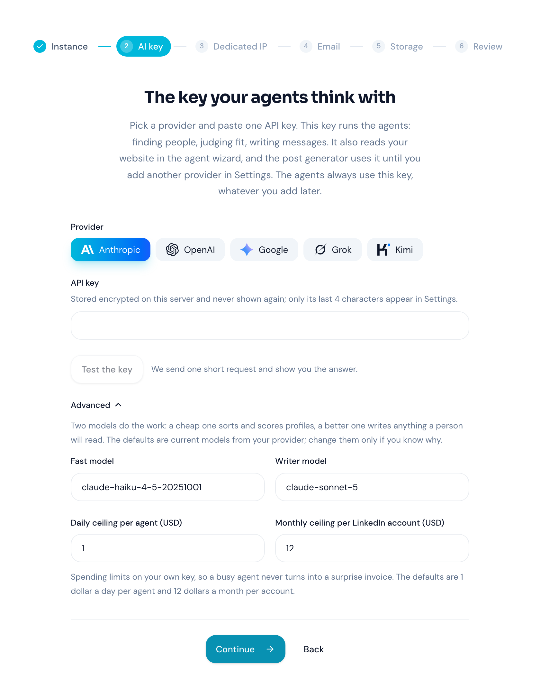
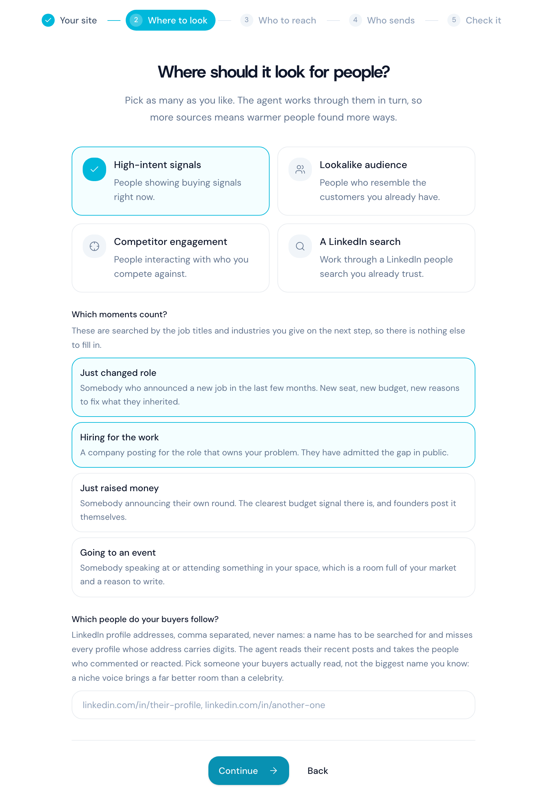
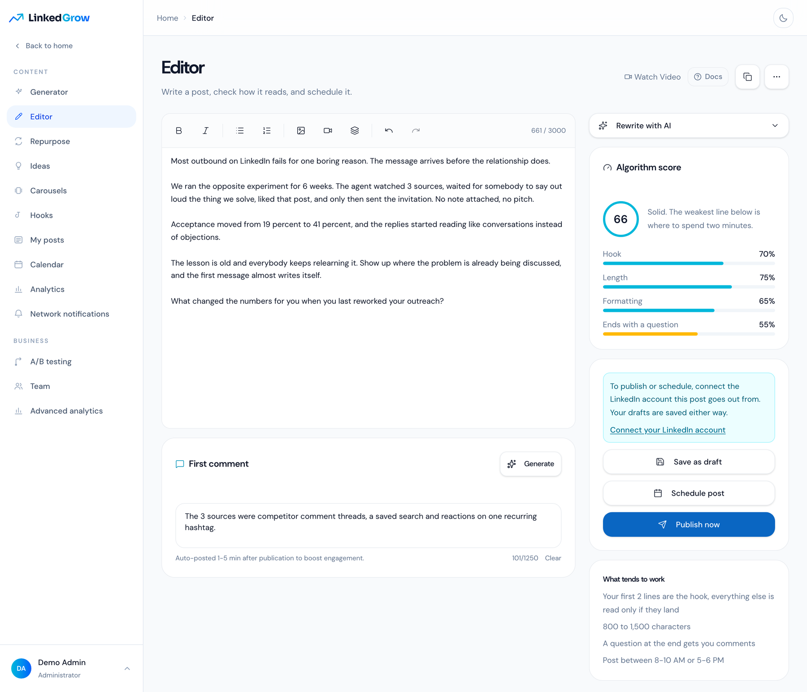
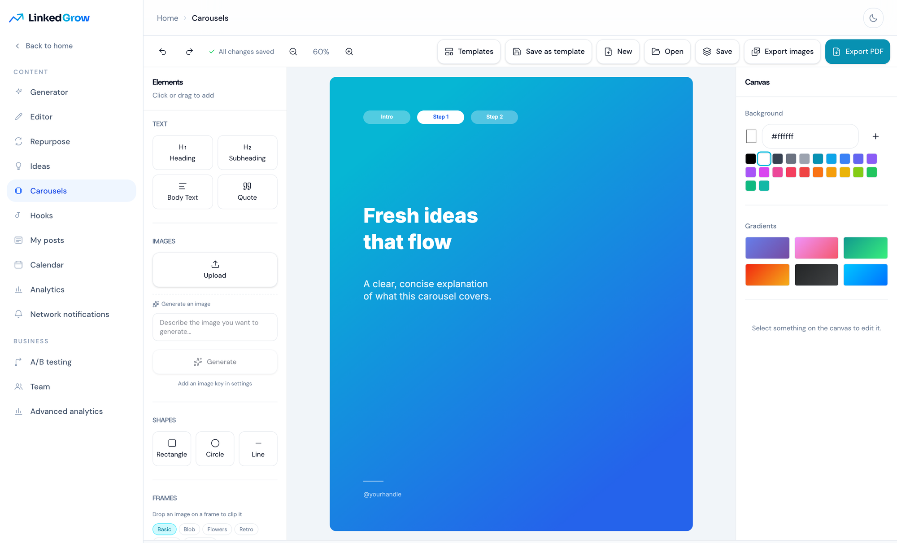

<div align="center">


# LinkedGrow

**AI agents that find your leads and clients on LinkedIn, running on a server you own.**

[](LICENSE)
[](#install)
[](docker-compose.yml)

[Install](#install) · [Docs](src/content/docs/self-hosting) · [Hosted version](https://linkedgrow.ai) · [Issues](https://github.com/DigiHold/LinkedGrow/issues) · [Contributing](CONTRIBUTING.md)

</div>



## What it does

You describe who you sell to, and an agent goes looking for those people where they already are: under a competitor's post, inside a search you already trust, among the people who reacted to a topic. It reads the profile, scores the fit, likes something real, and sends an invitation with no note attached. Once the person accepts, it runs a short conversation in your name and hands you the ones who want to talk. Every lead keeps the post or the search that produced it, so you always know where it came from.

The posting side is the same product. A generator writes a first draft in your voice, an editor scores the hook and the length before anything goes out, a calendar hands each post to LinkedIn's own scheduler, and the numbers on the analytics page are the ones LinkedIn showed on your posts. All of it, the agents and the publishing, happens in a real Chrome signed in to your account, on one dedicated address reserved for that account, moving at a human pace. There is no LinkedIn API in this product, because LinkedIn revokes the apps that do what this one does.

## Install

LinkedGrow is 3 containers and a compose file. Take whichever of the 3 ways below suits you, they all end at the same place.

### Hand it to an AI agent

An assistant with shell access to the server does the whole thing, because the run is written down for one in [llms-install.md](llms-install.md). Paste this into Claude Code, OpenClaw, Cursor or whatever you already point at your servers, with your own domain in it:

```text
Install LinkedGrow on this server by following
https://raw.githubusercontent.com/DigiHold/LinkedGrow/main/llms-install.md
with the domain linkedgrow.example.com. Use no key of your own, create no
account, and give me the address to open once the health check answers.
```

Drop the domain from that prompt to serve on the server address over plain http instead. The agent reads the page, runs the installer, and comes back with the address in 2 or 3 minutes.

### Docker Compose

The install every self hosted project uses, and it is 3 lines with nothing to edit. On a Linux host that already has Docker:

```sh
mkdir -p /opt/linkedgrow && cd /opt/linkedgrow
curl -fsSLO https://raw.githubusercontent.com/DigiHold/LinkedGrow/main/docker-compose.yml
docker compose up -d
```

When it comes up, open `http://<your server address>:3000` in a browser. There is no `.env` to write, no secret to generate and no address to declare. The app generates its own signing and encryption secrets on the first start and keeps them in a Docker volume, it answers on whatever address you opened, and the wizard at first login asks for everything else.

If your server already uses port 3000, the third line stops on a message from Docker about the address being in use. Write the port you want into a `.env` next to the compose file and run it again:

```sh
echo APP_PORT=3001 >> .env
docker compose up -d
```

To pin a version or run https, see [configuration](src/content/docs/self-hosting/configuration.md) and [reverse proxy](src/content/docs/self-hosting/reverse-proxy.md).

### One command

The script runs exactly those commands and adds what a bare server needs: it installs Docker when the command is missing, sizes `WORKER_SLOTS` from the memory of the machine, starts Caddy for https when you give it a domain, and waits for the health check before printing the address.

```sh
curl -fsSL https://raw.githubusercontent.com/DigiHold/LinkedGrow/main/install.sh | sh
```

It asks one question, your domain, and an empty answer serves over plain http on the server address. Read it first if piping a script into a shell makes you uncomfortable, it is 500 lines of POSIX sh and it does nothing you have not seen above. Its options are in the [install page](src/content/docs/self-hosting/install.md), including `--yes` for a run that asks nothing.

### Removing it

```sh
cd /opt/linkedgrow && ./install.sh uninstall
```

It asks you to type `remove`, then takes the containers, the volumes and the images with it. Add `--keep-data` to keep the volumes, so reinstalling later brings the instance back exactly as it was. The folder itself stays, with your compose file and your `.env`, and the script tells you the one line that removes it.

### After any of the 3

The first start pulls about 4 GB, most of it the browser the worker drives. Open the address, create the first account, which administers the instance, and answer the wizard once.



<details>
<summary><b>Build the images from the source instead</b></summary>

<br>

`./install.sh --source` clones the repository into the stack folder and builds both images there, which takes about 10 minutes. From a checkout you already have, the build override does the same thing:

```sh
docker compose -f docker-compose.yml -f docker-compose.build.yml up -d --build
```

It replaces the 2 published images with a build of the working tree and leaves everything else alone, secrets and address included. Local development, tests and the database rules live in [CONTRIBUTING.md](CONTRIBUTING.md).

</details>


## Finding the leads

An agent is one LinkedIn account, one audience and its own dedicated address. The wizard reads your home page once and fills the targeting for you, then you correct whatever it got wrong: the job titles, the industries, the countries, the company sizes, and the topics your buyers write about. You pick where it looks, from people showing buying signals right now to the ones engaging with a competitor or sitting inside a LinkedIn search you already use. You also pick which moments count, such as a new job, a company hiring for the work you do, or a funding announcement.

After that it runs on its own, inside the working hours you set. It scores every profile it finds, leaves the ones that do not fit alone, and works through the rest inside the daily limit for that account. Replies land in an inbox on the dashboard. The agent answers the ordinary ones itself, and it hands you anything that needs a person, with the thread attached.



## Writing the posts

The editor scores your draft on the hook, the length, the formatting and whether it ends on a question, and it says which line to spend 2 minutes on. The first comment is written next to the post and goes out a few minutes after it. A generator drafts from a topic in 4 steps when you would rather not start from a blank page, and Repurpose, Ideas and Hooks all feed the same editor.

Publishing goes through the worker rather than through an API. Press Publish and the post is queued, then written into the composer of your own account and read back off your feed to confirm it landed. A post you schedule for tomorrow is handed to LinkedIn's own scheduler hours before the slot, so nothing of ours has to be awake at 09:00. The analytics page then shows the impressions, reactions, comments and reposts the worker read off each post, and never an estimate.



## Carousels and the rest of it

The carousel editor ships 25 preset templates across 6 styles, with text, shapes, frames, image upload and generation, and it exports to PDF for LinkedIn or to images. Around it sit the calendar, A/B testing, network notifications, team seats on one workspace, your own branding, and an API you can point your own tools at: a REST API under `/api/v1` and an MCP endpoint at `/api/mcp`, both keyed by a token you create in Settings. The self hosted edition has every feature on, with no plan gate anywhere.



## What runs

| Service | What it is |
| --- | --- |
| `app` | The Next.js dashboard and API on port 3000. It runs the migrations at boot and serves uploads from the `uploads` volume. |
| `worker` | A Node 24 process driving one Chrome per LinkedIn account under Xvfb. `WORKER_SLOTS` sets how many run at once, and it defaults to 2. |
| `db` | A libSQL server with its data in `db-data`, reached at `http://db:8080` inside the stack, with no published port. |
| `caddy` | Optional, off unless you ask for it. With a domain it takes ports 80 and 443, gets the certificate and forwards to the app. |

## Requirements

- A Linux host, amd64 preferred (see the note on arm64 below).
- Docker with the Compose plugin, which the installer sets up when the command is missing.
- 4 GB of RAM for 2 concurrent browsers (`WORKER_SLOTS=2`), 16 GB for 12, and about 10 GB of free disk.
- A domain pointing at the server for https, or an open port 3000 for a plain http trial.
- An AI key from Anthropic, OpenAI, Google, Grok or Kimi, which runs every agent on the instance.
- A Proxy-Seller account for one dedicated address per LinkedIn account, or proxies of your own.

## Running it

`cd /opt/linkedgrow && ./install.sh update` pulls the current images and restarts the stack, which is what `docker compose pull && docker compose up -d` does by hand. Database migrations run when the app starts, and setting `LINKEDGROW_VERSION=v1.0.0` in a `.env` next to the compose file pins a release instead of following the main branch. The [updating page](src/content/docs/self-hosting/updating.md) covers the tags and the rollbacks.

Four volumes hold everything: `db-data` for the database, `uploads` for files, `profiles` for the signed in browser sessions, and `config` for the 2 secrets the app generated on its first start. Back up all 4 together, because a database restored beside a different `ENCRYPTION_KEY` is unreadable and that key lives in `config`. The [backups page](src/content/docs/self-hosting/backups.md) has the archive and restore commands, and the [reverse proxy page](src/content/docs/self-hosting/reverse-proxy.md) has the nginx and Caddy blocks, both for the bundled Caddy and for a proxy you already run.

Google Chrome ships for amd64 only on Linux, so on arm64 the worker image falls back to Chromium, which LinkedIn can tell apart from Chrome more easily. Release tags carry an arm64 image and `latest` does not, so an arm64 host runs a release tag or builds from source. Treat it as a way to try the product and run production on amd64. When something refuses to start, the [troubleshooting page](src/content/docs/self-hosting/troubleshooting.md) lists what the logs say and what to do about it.

## About your LinkedIn account

LinkedIn restricts accounts that automate, and no tool changes that. LinkedGrow spaces its actions out, keeps one stable address per account, ramps a new account up over 2 weeks and ships conservative daily limits. The account is yours and so is the responsibility for how hard you push it, so start with the defaults and raise them slowly.

## Docs and help

The full documentation lives on your instance at `/docs`, with the self hosting chapter under [src/content/docs/self-hosting](src/content/docs/self-hosting). Local development, the test commands and the rules a change has to follow are in [CONTRIBUTING.md](CONTRIBUTING.md). Bugs and requests go to [GitHub issues](https://github.com/DigiHold/LinkedGrow/issues), and anything security related goes to the address in [SECURITY.md](SECURITY.md) rather than a public issue.

Built by [Nicolas Lecocq](https://linkedgrow.ai) and Maria Lecocq, copyright 2026 Vayalis, licensed under the AGPL-3.0, see [LICENSE](LICENSE). A hosted version runs at [linkedgrow.ai](https://linkedgrow.ai) for people who would rather not run a server.
